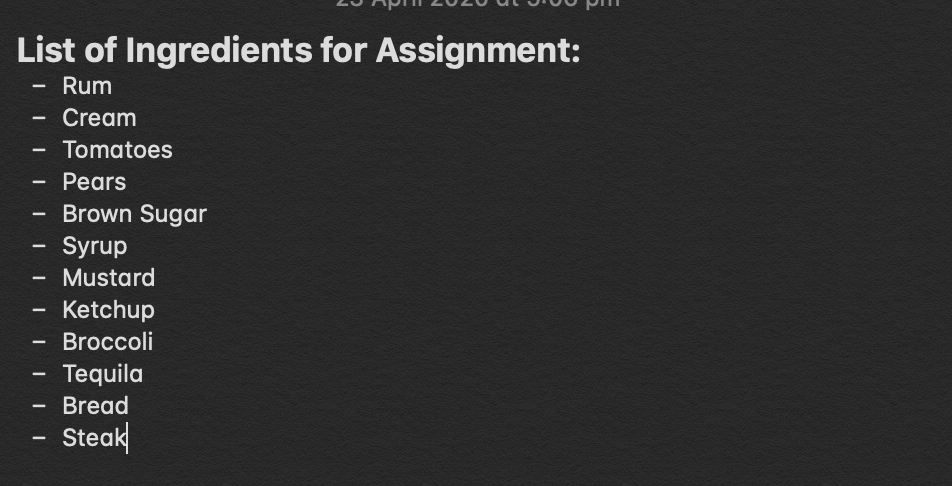

# 1701QCA Making Interaction - Assessment 2 workbook #

## The Kitchen Wheel ##

### Spinner Activity ###

*https://makecode.microbit.org/lessons/spinner/activity*

This project is related to mine because it also has a spinner wheel, and it has similar ideas to what I have planned for this project.

### Lucky Wheel ###

*https://makecode.adafruit.com/projects/lucky-wheel/code*

This project is related to mine because I am thinking of designing a wheel that randomly selects a different ingredient each time, and this project has a very similar idea to mine. 

### Dice ###

*https://makecode.adafruit.com/examples/dice*

This project is related to mine because this projects runs on the concept of chance and luck, and frankly, so does mine. 

### RC Car ###

*http://chibibit.io/ide/docs/projects/rc-car.html*

This project is related to mine because both this current project that I am working on and this related car project are both considered as 'toys', so they are both used to entertain people and to bring some fun into life. They can also both be good projects to work on during the Covid-19 pandemic as everybody is stuck inside. 

### Reaction ###

*https://makecode.adafruit.com/examples/reaction*

This project is related to mine because both of these projects are based on reactions and on patience. They can also both be considered as fun games. 

### Hot Potato ###

*https://makecode.adafruit.com/projects/hot-potato*

This project is related to mine because both of these projects are considered as 'entertaining' as they are both technically games. 

## Other research ##

Lucky Wheel Code Source:

https://makecode.adafruit.com/projects/lucky-wheel/code

*This website is relevant because it has a very similar idea to my project and this code could help me with mine. I am deciding to either use the exact coding from this project, or something similar to it.*

Spinner Activity Source:

https://makecode.microbit.org/lessons/spinner/activity

*This website is relevant because it also has a very similar idea to my project. I won't be using this particular code from it but I'll be using something similar to it.* 

### *Lucky Wheel* ###

https://makecode.adafruit.com/projects/lucky-wheel/code

*This resource is from the official Microbit MakeCode website. It has code that I really want to use as this project is a spinner wheel that lands on different answers. I will have to test it first, but I definitely want to use this website as a guide.*

## Conceptual progress ##

### Design intent ###
*My design intent is to create a fun game/social media challenge idea that would be perfect during the Covid-19 pandemic as everybody is forced to stay inside. I am planning to make a game where a machine randomly selects ingredients for you, so you could turn into a fun food challenge/game, and it can be used as a challenge idea or a fun game with your family, friends, or anybody else.*

### Design concept 1 ###
*The first design concept was to randomly pick ingredients at home, then list them and make a random list generator. I don;t think it was a very good concept to do, however, I was just listing ideas that I first thought of.*

### Design concept 2 ###
*The second design concept was to have the machine pick a randomised number, and then match the number to an ingredient. I decided that this was not going to be the final design concept as this would require two different lists, and that might end up not working as a lot of different types of code would be involved.*

### Final design concept ###
*The final descign concept (the one that I will actually be using thorughout this project) is to have the machine pick a random, different ingredient each time throught the use of a Lucky/Spinning Wheel. This idea was inspired by TV shows such as Masterchef and Wheel of Fortune. I am planning to make a cardboard wheel with a variety of ingredients and then attach it to a motor. I am also going to make a wheel as well and then program the motor so that the arrow lands on a different ingredient each time. The speed of the motor will be controlled by far the buttons on the actual microbit are pushed and for how long.*

### Interaction flowchart/diagram ###

*The plan is that if you press and hold either button/s A and/or B for different periods of time, it would control the speed and time of the motor, hopefully making the arrow attached to the wheel land on a different ingredient each time.* 

## Physical experimentation documentation ##

*This is the type of code I am aiming to use during the making of this project*

*This is the inspiration behind the design of the wheel. I am planning to attach an arrow to it that doesn't fly off easily.* 

*This is a list of some of the ingredients that I am planning to add to the wheel so far. I am either planning on adding more or taking some away, as I do not want to have too many ingredients as it might mess up the coding.*

## Design process discussion ##

*Discover:*
I had to discover ways to achieve my idea of making a fun game involving a random picking of ingredients. I really struggled to think of many different ways to achieve this idea. 

*Define:*
I had to really think of how to design the list or the type of machine that would pick the ingredients, and i had to picture different solutions in my head.*

*Develop:*
I ended up talking one-on-one with my tutor, Ged as I was really stuck to come up with solutions. He gave me the idea of a spinning wheel and arrow that is attached to a motor, and depending on how long the wheel spins for, it could give me different ingredients each time. He was talking about Masterchef, so I took that as another inspiration.*

*Deliever*
I ended up finding code and a design that might work for this idea. So I was confident and ready to start planning this project out.

## Next steps ##

*I still need to test the code, design the wheel and arrow, come up with more ingredients, come up with the final project, film me using it. Hopefully that won't take too long as this project is due at the end of Week 12, so I have only a month or so to go until this is due. Should be plenty of time.*
