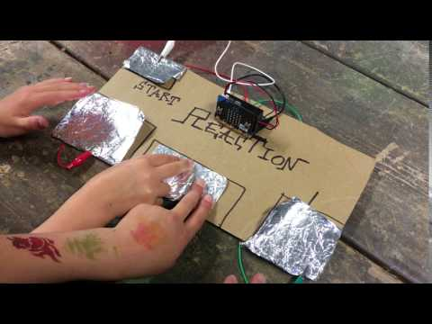

# 1701QCA Making Interaction - Assessment 2 workbook

## Project working title ##
*The Kitchen Wheel.*

### Related project 1 ###
*Spinner Activity*

*https://makecode.microbit.org/lessons/spinner/activity*

This project is related to mine because it also has a spinner wheel, and it has similar ideas to what I have planned for this project.

### Related project 2 ###
*Lucky Wheel*

*https://makecode.adafruit.com/projects/lucky-wheel/code*

This project is related to mine because I am thinking of designing a wheel that randomly selects a different ingredient each time, and this project has a very similar idea to mine. 

### Related project 3 ###
*Dice*

*https://makecode.adafruit.com/examples/dice*

This project is related to mine because this projects runs on the concept of chance and luck, and frankly, so does mine. 

### Related project 4 ###
*RC Car*

*http://chibibit.io/ide/docs/projects/rc-car.html*

This project is related to mine because both this current project that I am working on and this related car project are both considered as 'toys', so they are both used to entertain people and to bring some fun into life. They can also both be good projects to work on during the Covid-19 pandemic as everybody is stuck inside. 

### Related project 5 ###
*Reaction*

*https://makecode.adafruit.com/examples/reaction*

This project is related to mine because both of these projects are based on reactions and on patience. They can also both be considered as fun games. 

### Related project 6 ###
*Hot Potato*

*https://makecode.adafruit.com/projects/hot-potato*

This project is related to mine because both of these projects are considered as 'entertaining' as they are both technically games. 

## Other research ##

Lucky Wheel Code Source:

https://makecode.adafruit.com/projects/lucky-wheel/code

*This website is relevant because it has a very similar idea to my project and this code could help me with mine. I am deciding to either use the exact coding from this project, or something similar to it. 

Spinner Activity Source:

https://makecode.microbit.org/lessons/spinner/activity

*This website is relevant because it also has a very similar idea to my project. I won't be using this particular code from it but I'll be using something similar to it. 

### *Brief resource name/description* ###

https://makecode.adafruit.com/projects/lucky-wheel/code

*This resource is from the official Microbit MakeCode website. It has code that I really want to use as this project is a spinner wheel that lands on different answers. I will have to test it first, but I definitely want to use this website as a guide.*

## Conceptual progress ##

### Design intent ###
*My design intent is to create a fun game/social media challenge idea that would be perfect during the Covid-19 pandemic as everybody is forced to stay inside. I am planning to make a game where a machine randomly selects ingredients for you, so you could turn into a fun food challenge/game, and it can be used as a challenge idea or a fun game with your family, friends, or anybody else.*

### Design concept 1 ###
*The first design concept was to randomly pick ingredients at home, then list them and make a random list generator. I don;t think it was a very good concept to do, however, I was just listing ideas that I first thought of.*

### Design concept 2 ###
*The second design concept was to have the machine pick a randomised number, and then match the number to an ingredient. I decided that this was not going to be the final design concept as this would require two different lists, and that might end up not working as a lot of different types of code would be involved.*

### Final design concept ###
*This more fully developed concept should include consideration of the interaction scheme, technical functionality, fabrication approach, materials to be used, and aesthetic.*

### Interaction flowchart ###
*Draw a draft flowchart of what you anticipate the interaction process in your project to be. Make sure you think about all the stages of interaction step-by-step. Also make sure that you consider actions a user might take that aren't what you intend in an ideal use case. Insert an image of it below. It might just be a photo of a hand-drawn sketch, not a carefully drawn digital diagram. It just needs to be legible.*

## Physical experimentation documentation ##

*In this section, show your progress including whichever of the following are appropriate for your project at this point.
a.	Technical development. Could be code screenshots, pictures of electronics and hardware testing, video of tests. 
b.	Fabrication. Physical models, rough prototypes, sketches, diagrams of form, material considerations, mood boards, etc.
Ensure you include comments about the choices you've made along the way.*

*You will probably have a range of images and screenshots. Any test videos should be uploaded to YouTube or other publicly accessible site and a link provided here.*

## Design process discussion ##
*Discuss your process in getting to this point, particularly with reference to aspects of the Double Diamond design methodology or other relevant design process.*

## Next steps ##
*Write a list or provide other information about your plan to move the project forward to be ready to present by video and documentation in week 12 of the course.*
